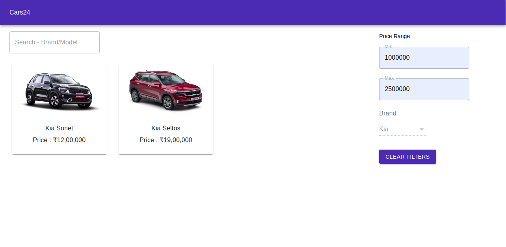

# Cars24 Assignment

## This project is an exercise to do the following actions:

	1. Show product items in grid 
	2. Implement infinite scroll for product items
	3. Show search bar at top where user can able to search products
	4. Show price range filter, product filter on sidebar, selecting them filter out the result

## Steps to run the project
	
	1. Enter the project directory
	2. Run `node server.js`
	3. Run `npm start`

## Available Scripts

In the project directory, you can run:

### `npm start`

Runs the app in the development mode.\
Open [http://localhost:3000](http://localhost:3000) to view it in the browser.

### `npm test`

Launches the test runner in the interactive watch mode.

### `npm run build`

Builds the app for production to the `build` folder.\
It correctly bundles React in production mode and optimizes the build for the best performance.

The build is minified and the filenames include the hashes.

### `node server.js`

Runs a basic express server at port 3001. This is created to serve products requested from frontend in a paginated fashion.

## Explanation

	1. The main page displays all the products available at the moment and more products are fetched as 
	   you scroll down.
	2. The filters can be applied on the products available on the basis of either price range or the 
	   brand.
	3. Once the filters are applied, the filter boxes and the search box gets disabled and you need to 
	   clear the applied filters before using them again.
	4. Filtered products are preserved after the page reload as well.

# Screenshots

Sign Up Page:

